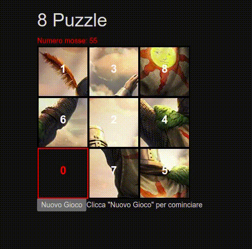

# 8-Puzzle--Game__Javascript
8 Puzzle Game is a browser game developed in Javascript (Vanilla) as a funny exercise in our web programming class at Università di Roma "Tor Vergata".
You can find the Subject in this repo (Italian).

To play the game, clone this repo and open "index.html" with your favourite browser!

What we learned in this class:
- HTML5 & CSS 
- APIs
- Javascript
- asynchronous Javascript (AJAX)
- Node Js
- promises

## Demo

